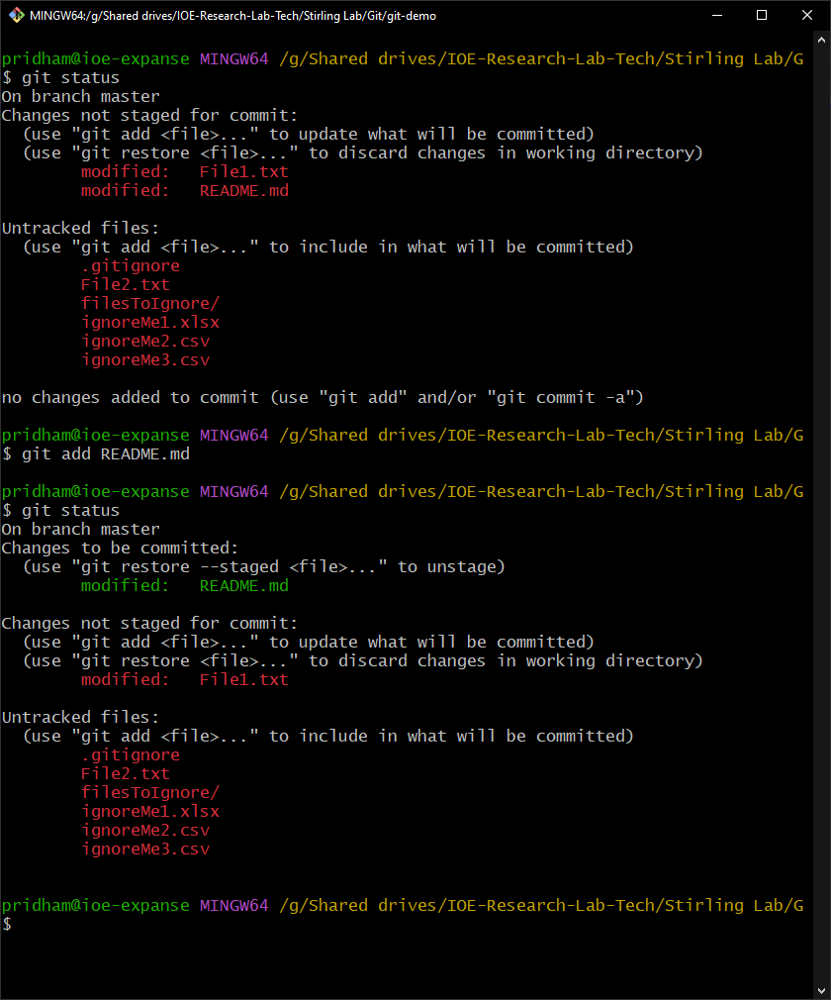
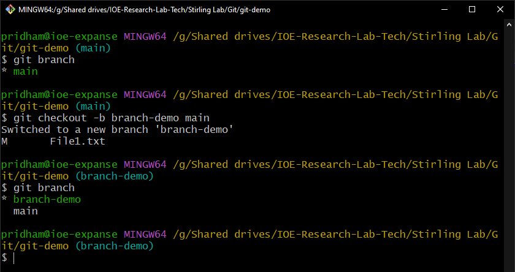

# Git Demo Script
## Table of content
- [Do Ahead of Time](#do-ahead-of-time)
- [Background](#background)
    - [What's That](#whats-that)
- [Structure](#structure)
    - [Working Directory](#working-directory)
        - [Check Status (status)](#check-status)
    - [Staging Area](#staging-area)
        - [Move File to the Staging Area (add)](#move-file-to-the-staging-area)
    - [Local Repository](#local-repository)
        - [Commit Files (commit)](#commit-files)
        - [Repository Structure](#repository-structure)
        - [Files not to use git for](#files-not-to-use-git-for)
    - [Remote Repository](#remote-repository)
        - [Send Update to the Remote (push)](#send-update-to-the-remote)
        - [Update the Local Repo Based on the Remote Repo (fetch)](#update-the-local-repo-based-on-the-remote-repo)
        - [Update the Working Directory from the Local Repository (merge)](#update-the-working-directory-from-the-local-Repository)
        - [Fetch and Merge (pull)](#fetch-and-merge)
- [Demo](#demo)
    - [Create Repo](#create-repo)
    - [Clone Repo](#clone-repo)
    - [Update Remote Repository](#update-remote-repository)
    - [Resolving Conflicts](#resolving-conflicts)
- [gitignore](#gitignore)
- [Remove Files from Tracking (rm)](#remove-files-from-tracking)
- [See the Differences Between Versions (diff)](#see-the-differences-between-versions)
- [Replace a File in the Working Directory with the One in the Repo (restore)](#replace-a-file-in-the-working-directory-with-the-one-in-the-repo)
- [Save Changes to Come Back to (stash)](#save-changes-to-come-back-to)
- [Branches](#branches)
    - [Creating a Branch](#creating-a-branch)
    - [Rename Branch](#rename-branch)
    - [Change Branch in Working Directory (checkout)](#change-branch-in-working-directory)
    - [Merge Branch into Parent Branch](#merge-branch-into-parent-directory)
    
## Do ahead of time
- Have the lab slack open for sharing link
- Have a GitHub account with SSH Setup
  - [Windows](https://docs.github.com/en/authentication/connecting-to-github-with-ssh/generating-a-new-ssh-key-and-adding-it-to-the-ssh-agent?platform=windows)
  - [Mac](https://docs.github.com/en/authentication/connecting-to-github-with-ssh/generating-a-new-ssh-key-and-adding-it-to-the-ssh-agent?platform=mac)
  - [Linux](https://docs.github.com/en/authentication/connecting-to-github-with-ssh/generating-a-new-ssh-key-and-adding-it-to-the-ssh-agent?platform=linux)
- Have [git](https://github.com/git-guides/install-git) installed on your computer 
- Have a text editor you like available to modify files.
- From a command prompt/terminal know how to navigate to different directories.

### 
---
## Background
### What's that
- **Git** - A way of doing version control for files.
- **Version Control** – A way of tracking changes to files and know what is the most recent.

---
## Structure
- Can be done totally locally but often uses a central repository (repo) so it is easier to collaborate.
- Each system has its own repository which is a complete history of the changes that have been committed and can synchronize one system’s repo with the central repo.

  

from: https://git-scm.com/book/en/v2/Getting-Started-What-is-Git%3F

---
### Working Directory
- This is the area you are working in
- The changes you make here are not in the repository till you commit them
- You can have untracked files 

#### Check Status 
```git status```
Displays the status of the various files in the working directory.
- Untracked files - Files that have not been added to the repository
- Modified files - Files that have been changed
- Deleted files - files that have been deleted from the working directory.
- Staged files - Files that have been staged for a commit. 


---
### Staging Area
- This is where you have said what files you are getting ready to commit
- They are still not in the repository
- You just want to add the files relevant to the commit you are making.

#### Move file to the staging area
```git add <filename>```



---
### Local Repository
- This is the place where all the versions of the code are stored
- It has a complete history of all the versions that have been added

#### Commit Files 
```git commit -m ‘<commit message>’```

**Takes the staged files and moves (commits) them to the local repository**
- Do it often and only stage files that are relevant.
- Give descriptive messages about what was done.
- Make commits only for code that is working, or note the issue.


#### Repository Structure
Each version has a full copy of the repository at that point


From: https://git-scm.com/book/en/v2/Getting-Started-What-is-Git%3F

####  Files not to use git for
- *Jupyter Notebooks* - Each time you run a section again it records it so you could not change anything about the file and it creates new versions, and then you and your collaborator would have conflicting versions that need to be resolved.
- *CAD Files* - These can be large and every version has a complete copy of all the files, so even if you aren’t changing it makes the repo huge.
- *Data Files*
- *Really any Large Files*

---
### Remote Repository
This is a central place where the repository can be stored for multiple people to access
It has the same repository (when everyone is updated), as the remote repositories

![An image showing the working directory, staging area, committed files (local repository), and remote repository.  There are is an arrow labeled "git add" pointing from the working directory to the staging area, an arrow labeled "git commit" pointing from the staging area to the local repository, an arrow labeled "git push" pointing from the local repository to the remote repository, an arrow labeled "git fetch" pointing from the remote repository to the local repository, and two arrows pointing from the local repository to the working directory labeled "git checkout" and "git merge".](./images/remote.png)

from: https://phoenixnap.com/kb/how-git-works

#### Send Update to the Remote
```git push```
- Many commits can be done prior to pushing

TODO: add image

#### Update the Local Repo Based on the Remote Repo
```git fetch```

TODO: add image

Update

#### Update the Working Directory from the Local Repository
```git merge```

TODO: add image

#### Fetch and Merge
```git pull```

TODO: add image

---
## Demo 
The demo will have 3 groups
1. Primary - The main person presenting they will demonstrate things to everyone.
2. Secondary - A person to help with the presentation by creating updates from another user that can be brought down.
3. Everyone - This is everyone else and some things we will want them to play with.

### Create Repo
- **Primary**
    - Open github.com and create a repository
    
    
    
    - Initialize an existing local repository, it should have some files already.
        ```
        cd <location to make repo>
        git init
        git add .
        git commit -m '<commit message>'
        ```
    - Connect the local repo to the remote
        - Assumes the local is already initialized and has committed files, and the remote repo already exists
        ```
        git branch -M main
        git remote add origin <git remote repo location>
        git push -u origin main
        ```
    
- **Secondary**
    - NONE
- **Everyone**
    - NONE

### Clone Repo
If you don't already have files to add you can also just clone repository, rather than initializing and adding the remote like we did above.
- **Primary** 
    - Walk through where to find the address to clone from the github page.
    - 
- **Secondary** 
    - Follow everyone so you have a copy.
- **Everyone** 
    - Clone the repository to a location on your computer.
    ```
    cd <location on computer to place repository>
    git clone <location of remote repository>
    ```

### Update remote repository
- **Primary** 
    - Make a change to one of the files 
    - Push changes to the remote
        ```
        git status
        git add <file to add>
        git status
        git commit -m 'showing a change to the file'
        git push
        ```
    - Show the changes in the github page
- **Secondary**
    - follow everyone
- **Everyone** 
    - Pull the changes to your working repository
        ```
        git fetch
        git merge
        ```
        or 
        ```
        git pull
        ```
    - Create a new file with your name and favorite coding extension
    - Push your file and wait for everyone to finish pushing theirs
        ```
        git status
        git add <file to add>
        git status
        git commit -m 'creating my (<name>) file'
        git push
        ```
    - Pull the changes back down
        ```
        git pull
        ```
    
    We should each now have everyone's files in our working directory without any problems.

### Resolving Conflicts
- **Secondary**
    - Select a file and modify 2 lines
    - Push the changes
        ```
        git add <file to add>
        commit -m 'I hope no one else is working on this file'
        git push
        ```
- **Primary**
    - In the same file the secondary is modifying also modify 2 lines.
        - A line the secondary didn't modify.
        - A line the secondary did modify.
    - Push the changes. It should say you need to fetch first.  The primary follows the secondary so everyone can see how to resolve the conflict.
        ```
        git add <file to add>
        commit -m 'creating conflicts'
        git push
        ```
    - Look at the conflict and select which one to go with deleting the section to remove.
- **Everyone**
    - Please just watch, we don't want a lot of conflicts, just a few.

## gitignore
- A text file that specifies files to ignore in the same directory as the file, this is named '.gitignore'.
- The '*' is a wildcard character which represents all characters and represents one or more characters.
- ```*.<extension>``` ignores all files of that extension type in the same directory, for example ```*.csv``` will ignore all csv files.
- Whole directories can be ignored as well ```<folder name>/*```, this will ignore everything in this folder.
- .gitignore files can contain themselves if you would like it to just ignore the files on your computer.  They can also be committed to the repo if everyone is going to share the .gitignore.
- More patterns can be found in the [git documentation](https://git-scm.com/docs/gitignore).
- **Primary**
    - Create .gitignore file for the directory.
    - Create some files and a directory to ignore.
    - Add them to the .gitignore using ```status``` to show when they stop showing up.
- **Secondary**
    - Follow everyone
- **Everyone**
    - Just watch and absorb.

## Remove Files from Tracking
```git rm <file to remove>```
- Removes the file from the working directory and removes it from the repo going forward.
- If the file is already deleted stops if from being tracked going forward.
TODO: add image.

## See the Differences Between Versions
```git diff <file to check>```
- This shows the difference between the file in the working directory and the one in the staging area.

```git diff HEAD <file to check>```

- This shows the difference between the file in the staged area and the most recent one in the repository.
- There are other ways of checking the difference between commits or other fancier things, but are less frequently used.
- For longer commits you may need to use <kbd>Enter</kbd> to scroll through the output, and <kbd>q</kbd> to exit.
- Handy if you have been bad about regular commits and need to figure out the changes you have made to make your commit message, *but this will **never** happen to you because you are going to **always** be good about regular commits.* Right?... ***Right***?

TODO: ADD IMAGE

## Replace a File in the Working Directory with the One in the Repo
```git restore <file to replace with the repo version>```
- If you have decided your updates are too far gone for you to make them work or you just want to get rid of your uncommitted changes.

## Save Changes to Come Back to
```git stash <files to stash>```
- I have used this when needing to merge. I have yet to unstash something.


## Branches
Branches are a way of creating an area where 


From: https://www.atlassian.com/git/tutorials/using-branches/git-merge

### Creating a Branch
```git checkout -b <new branch name> <parent branch name>```
This creates a new branch from the parent branch, and makes that the active branch in the working directory.



### Rename Branch
```git branch -m <new name to use>```
- **Use cautiously as this can create some issues if other people haven't renamed their branches**

### Change Branch in Working Directory
```git checkout <branch name>```


### Merge Branch into Parent Branch


